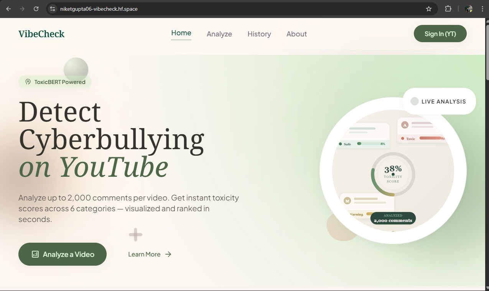
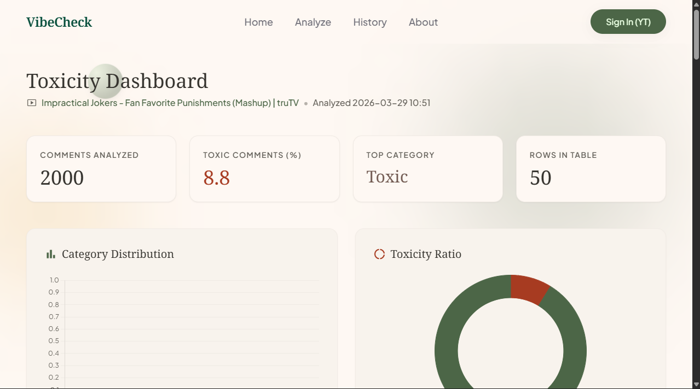
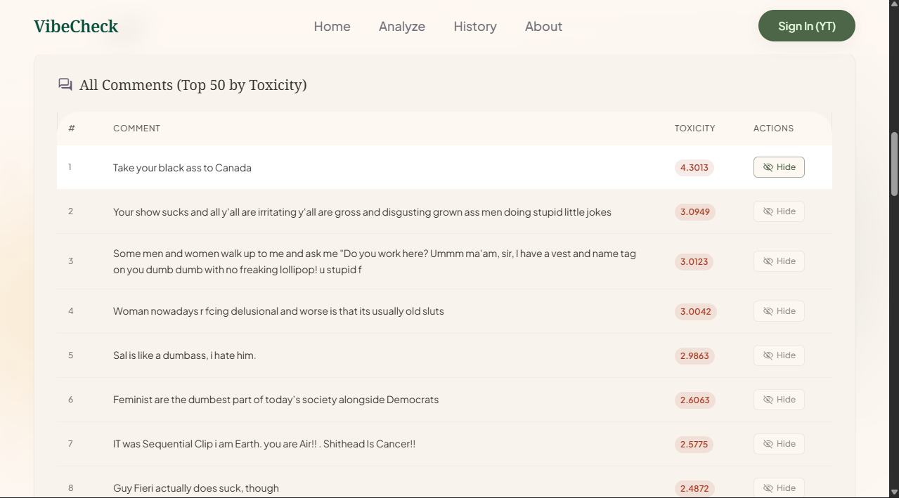

<div align="center">

# 🛡️ VibeCheck

### *Because your comment section deserves better.*


<br/>

> **VibeCheck** is an AI-powered cyberbullying detection app that analyzes YouTube comments at scale — fetching thousands in seconds — using a fine-tuned BERT model trained to spot toxicity across **6 categories**. Creators can even hide the bad stuff directly from the dashboard. 🚀

<br/>

### 🌐 [Try the Live Demo →](https://niketgupta06-vibecheck.hf.space/)

<br/>

</div>
⚠️ Important Notice: 
The application's Google OAuth is currently in development mode. When attempting to sign in, Google may display a warning that the **app isn't verified**. This is expected behaviour. To access the site, click Advanced, then follow the link to proceed. It is completely safe to use.

## 🤔 What Even Is This?

Ever scrolled through a YouTube comment section and felt like the internet needed a shower? Yeah. Us too.

**VibeCheck** is a web app that lets you paste any YouTube URL and instantly get a full toxicity report on the comments — powered by `ToxicBERT`, a fine-tuned version of `bert-base-uncased` trained on the [Jigsaw Toxic Comment Classification dataset](https://www.kaggle.com/c/jigsaw-toxic-comment-classification-challenge).

It scores every comment across **6 toxicity categories**, visualizes the data beautifully, saves your scan history, and — the best part — lets content creators **natively hide toxic comments** straight from the dashboard using their YouTube account. No copy-pasting. No manual hunting. Just click and *poof*.

---

## ✨ Features That Slap

| Feature | What It Does |
|---|---|
| 🔗 **Instant URL Analysis** | Paste a YouTube URL → get thousands of comments analyzed in seconds |
| 🧠 **ToxicBERT Engine** | Fine-tuned BERT model, built for precision toxicity detection |
| 📊 **6-Category Scoring** | Every comment scored on `toxic`, `severe_toxic`, `obscene`, `threat`, `insult`, `identity_hate` |
| 🔐 **YouTube OAuth** | Creators sign in with Google to moderate & hide comments natively |
| 🗂️ **Scan History** | All your past analyses saved to an embedded SQLite DB — revisit anytime |
| 💅 **Premium UI** | Glassmorphic Tailwind CSS design with ambient backgrounds & micro-animations |

---

## 🧠 How It Works

```
📹 YouTube URL
      │
      ▼
🔌 YouTube Data API v3       ← Fetches top-level comments at scale
      │
      ▼
🤗 ToxicBERT (BERT fine-tuned) ← Runs inference on each comment
      │
      ▼
📊 6-Category Probability Scores  ← toxic | severe_toxic | obscene | threat | insult | identity_hate
      │
      ▼
🎛️ VibeCheck Dashboard       ← Visualized beautifully with Chart.js
      │
      ▼
🗑️ [Optional] Hide via OAuth  ← Content creator hides toxic comments natively
```

---

## 🛠️ Tech Stack

<details>
<summary><b>🐍 Backend & ML</b> (click to expand)</summary>

- **Python 3.10** — The backbone
- **Flask** — Lightweight, fast web framework
- **Hugging Face Transformers** — Model loading and inference via the Hub
- **PyTorch** — Runs the deep learning inference engine
- **SQLite** — Embedded DB for scan history (zero setup!)

</details>

<details>
<summary><b>🎨 Frontend & UI</b> (click to expand)</summary>

- **HTML5 + Jinja2 Templates** — Server-side rendering
- **Tailwind CSS** — Utility-first, responsive, glassmorphic design
- **Chart.js** — Interactive toxicity visualizations
- **Vanilla JavaScript** — DOM magic and OAuth flow handling

</details>

<details>
<summary><b>🚀 Deployment</b> (click to expand)</summary>

- **Docker** — Containerized and reproducible builds
- **Gunicorn** — Production-grade WSGI server
- **Hugging Face Spaces** — Free 16GB RAM Docker hosting (seriously, it's amazing)

</details>

---

## 🚀 Run It Locally

Want to spin this up on your machine? Let's go.

### Step 1 — Clone & Install

```bash
git clone https://github.com/NiketGupta06/vibeCheck.git
cd vibeCheck
pip install -r requirements.txt
```

> Make sure you're on **Python 3.10+**. Run `python --version` to check.

---

### Step 2 — Set Up Environment Variables

Create a `.env` file in the project root:

```env
# YouTube Data API v3 Key (get one free from Google Cloud Console)
YOUTUBE_API_KEY=your_api_key_here

# A random secure string for Flask session management
FLASK_SECRET_KEY=some_super_secret_random_string
```

---

### Step 3 — Enable Google OAuth *(for the comment-hiding superpower)*

1. Head to the [Google Cloud Console](https://console.cloud.google.com/)
2. Enable the **YouTube Data API v3**
3. Create an **OAuth 2.0 Client ID** (choose *Web application*)
4. Download the credentials JSON → rename it `client_secrets.json`
5. Drop it in the **root folder** of the project

> ⚠️ Without this step, the analysis still works — you just won't be able to hide comments.

---

### Step 4 — Fire It Up 🔥

```bash
python app.py
```

Open your browser and go to **[http://localhost:5000](http://localhost:5000)**. You're live. ✅

---

## 📸 Screenshots


| Home Page | Analysis Dashboard | Comment Report |
|---|---|---|
|  |  |  |

---

## 👥 Meet the Team

<table>
  <tr>
    <td align="center">
      <b>Niket Gupta</b><br/>
      <i>Model Analysis & Platform Development</i><br/>
      <a href="https://www.linkedin.com/in/niketgupta06/">LinkedIn</a> · <a href="https://github.com/NiketGupta06">GitHub</a>
    </td>
    <td align="center">
      <b>Sonakshi Panda</b><br/>
      <i>Model Analysis & Research</i><br/>
      <a href="https://www.linkedin.com/in/sonakshi-panda/">LinkedIn</a> · <a href="https://github.com/sonakshi03-06panda">GitHub</a>
    </td>
  </tr>
</table>

---

## ⚠️ Disclaimer

AI scores are **probabilistic guidance**, not court verdicts. `ToxicBERT` is trained on English text — performance may degrade on heavy slang, multilingual content, or highly localized dialects. Always use human judgment alongside AI recommendations.

---

## 🌟 If You Liked This...

Leave a ⭐ on the repo! It helps more than you think.

[](https://github.com/NiketGupta06/VibeCheck-CyberBullying-Detection)

---

<div align="center">
  <sub>Built with 💙 and a deep hatred of toxic comment sections.</sub>
</div>